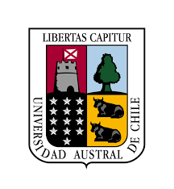

 

# 
**Informe: Descripción de lo aprendido**

#### Nombres: Felipe Villarroel y Josias Pinilla

#### Profesor: Victor Poblete

#### Ayudante: Esteban Vargas

#### Asignatura: Procesamiento digital de señales, ACUS099

